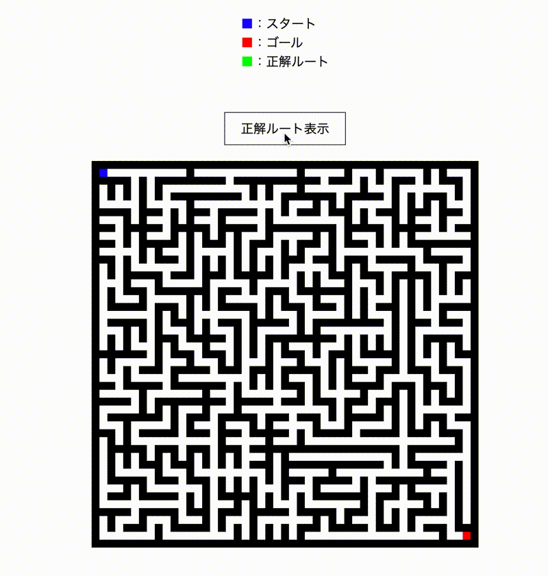

# [迷路作成プログラム](http://grayhorse5.sakura.ne.jp/generate-maze/)

## Description

本プログラムは、自動で迷路を作成する。使用言語は JavaScript。迷路の生成は壁伸ばし法を、正解ルートの探索には幅優先探索をそれぞれ用いた。

## Demo

## Referenses

- [迷路生成(壁伸ばし法) - Algoful](https://algoful.com/Archive/Algorithm/MazeExtend#definition2)
- [幅優先探索 - Algoful](https://algoful.com/Archive/Algorithm/BFS)
- [ネタがないので迷路を自動生成してみた | 東京工業大学デジタル創作同好会 traP](https://trap.jp/post/472/)
- [幅優先探索 - Wikipedia](https://ja.wikipedia.org/wiki/%E5%B9%85%E5%84%AA%E5%85%88%E6%8E%A2%E7%B4%A2)

